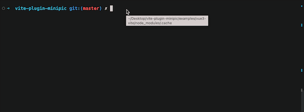

# vite-plugin-minipic

**中文** | [English](README.md)  
vite图片压缩插件，使用简单，重要的是它真的很快 🚀🚀🚀🚀！!  
基于[sharp](https://github.com/lovell/sharp)开发  


## ❓为什么选择minipic?

- 🚀 极快压缩速率  
  本插件基于[sharp.js](https://github.com/lovell/sharp)，压缩速率极快。  
  完全满足项目多图、大图压缩需求。  
  实测40M的图片文件压缩时间只需要3秒左右，整体压缩体积可以在70%~80%以上（设备：macbook m1。压缩质量设定：75%）。
- 💾 增量压缩/缓存控制  
  默认开启增量压缩功能，在首次进行图片压缩时会把压缩后的图片存在本地磁盘中，后续直接读取缓存文件加快压缩速率，杜绝多次重复压缩图片

- 📷 图片类型转换  
  可以在压缩同时将图片转为其他格式

- 🔎 特定图片压缩/排除  
  可以框定压缩图片的范围，也可以对不想进行压缩的图片进行排除

## 📦 安装

```JS
npm install vite-plugin-minipic -D
```

你可以自由选择任何包管理工具，推荐`yarn`和`pnpm`

❗❗❗ 安装失败？  
如果你无法安装，请在你全局或者项目目录下的.npmrc文件中加入以下配置

```JS
registry="https://registry.npm.taobao.org"
sharp_binary_host="https://npm.taobao.org/mirrors/sharp"
sharp_libvips_binary_host="https://npm.taobao.org/mirrors/sharp-libvips"
```

更多问题见：[常见问题及解决方法](https://github.com/60late/vite-plugin-minipic/issues/2)

## 💻 使用

### 基本使用

in vite.config.js

```javascript
import minipic from 'vite-plugin-minipic'
export default defineConfig({
	plugins: [minipic()]
})
```

### 自定义配置

in vite.config.js

```javascript
import minipic from 'vite-plugin-minipic'
export default defineConfig({
	plugins: [
		minipic({
			sharpOptions: {
				png: {
					quality: 70
				},
				jpeg: {
					quality: 33
				},
				jpg: {
					quality: 70
				}
			},
			convert: [
				{ from: 'png', to: 'webp' },
				{ from: 'jpg', to: 'webp' },
				{ from: 'jpeg', to: 'jpg' }
			],
			cache: true
		})
	]
})
```

## 🔨 配置项

| 参数         | 类型                   | 默认值                        | 说明                                                                                                                                                                                                                                                                                                        |
| ------------ | ---------------------- | ----------------------------- | ----------------------------------------------------------------------------------------------------------------------------------------------------------------------------------------------------------------------------------------------------------------------------------------------------------- |
| sharpOptions | Object                 | [sharpOptions](#sharpoptions) | 图片压缩选项，和sharp.js的配置保持一致.关于更多sharp.js的配置项，见[sharp.js](https://sharp.pixelplumbing.com/api-output#jpeg)                                                                                                                                                                              |
| convert      | Object                 | [convert](#convert)           | 你可以通过这个选项控制图片经过处理后的类型 `from` 是原始类型 `to` 是处理后的类型                                                                                                                                                                                                                            |
| cache        | Boolean                | true                          | 第一次压缩后会将已压缩文件存入磁盘中进行缓存以提高压缩速度，如果不想占用本地磁盘空间将此值设置为false，则每次都会全量压缩                                                                                                                                                                                   |
| exclude      | `string` or `string[]` | []                            | 你可以通过通过这个选项排除不想要进行压缩的文件。 1.如果值为一个字符串数组，比如`exclude:['pic1.jpg','pic2.jpg']`,那么pic1和pic2将会被排除。2. 如果值为一个字符串，比如`exclude:'.jpg'`,那么这个值将被作为一个正则表达式，所有的.jpg文件都会被排除在外.如果`exclude`和`include`同时存在时，`include`将会失效 |
| include      | `string` or `string[]` | []                            | 你可以通过通过这个选项排除不想要进行压缩的文件。1.如果值为一个字符串数组，比如`include:['pic1.jpg','pic2.jpg']`,那么pic1和pic2将会被压缩。 2. 如果值为一个字符串，比如`include:'.jpg'`,那么这个值将被作为一个正则表达式，所有的.jpg文件都会被压缩. 如果`exclude`和`include`同时存在时，`include`将会失效    |

### sharpOptions

图片压缩选项，和sharp.js的配置保持一致。  
关于更多sharp.js的配置项，见[sharp.js](https://sharp.pixelplumbing.com/api-output#jpeg)

默认值：

```javascript
sharpOptions: {
	avif: {
		quality: 75
	},
	jpeg: {
		quality: 75
	},
	jpg: {
		quality: 75
	},
	png: {
		quality: 75
	},
	webp: {
		quality: 75
	},
	gif:{}
}
```

### convert

你可以通过这个选项控制图片经过处理后的类型
`from` 是原始类型
`to` 是处理后的类型

例子:

```javascript
convert: [
	{ from: 'png', to: 'png' },
	{ from: 'jpg', to: 'jpeg' },
	{ from: 'jpeg', to: 'webp' },
	{ from: 'avif', to: 'avif' }
]
```

For more detail config, see [sharp.js](https://sharp.pixelplumbing.com/api-output#jpeg).

## 看看例子

Run examples

```
yarn vue3
```

or

```
npm run vue3
```

## 目前支持的图片格式

目前只支持 avif、jpeg、jpg、png、webp、gif 格式
更多图片格式会在后续版本中进行支持

## 待办

- [x] 缓存功能
- [x] 排除特定不压缩的文件
- [x] 只对特定文件进行压缩
- [ ] 更多图片类型支持

## 证书

MIT

## 灵感来源

[vite-plugin-imagemin](https://github.com/vbenjs/vite-plugin-imagemin)  
[unplugin-imagemin](https://github.com/ErKeLost/unplugin-imagemin)
